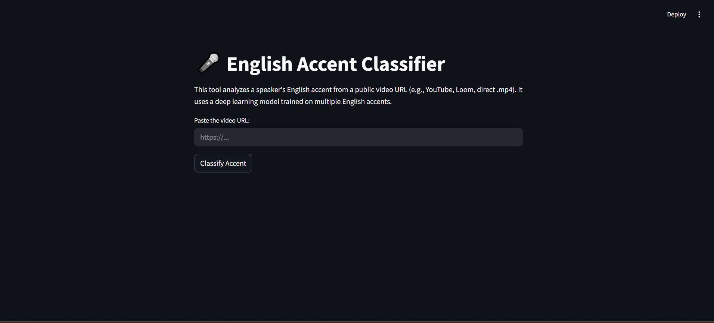

# English-Accent-Classifier
Accent Analyzer Tool is a Python-based application that uses SpeechBrain and HuggingFace models to classify the English accent spoken in an audio or video clip. It extracts audio from YouTube URLs or local files, processes the speech, and predicts the most likely English accent (e.g., British, Indian, American, etc.).
# 🎙️ Accent Detection Web App

A simple Streamlit-based web app for classifying spoken English accents using SpeechBrain and a pre-trained model.

---

## 📦 Features

- Upload and classify any `.wav` audio file
- Supports multiple English accents
- Uses a deep learning model via SpeechBrain
- Built with Streamlit and PyTorch

---

## 🚀 Demo



---

## 🛠️ Installation

```bash
# Clone the repo
git clone https://github.com/yourusername/accent-detector.git
cd accent-detector

# Create virtual environment
python -m venv .venv
source .venv/bin/activate  # or .venv\Scripts\activate on Windows

# Install dependencies
pip install -r requirements.txt
